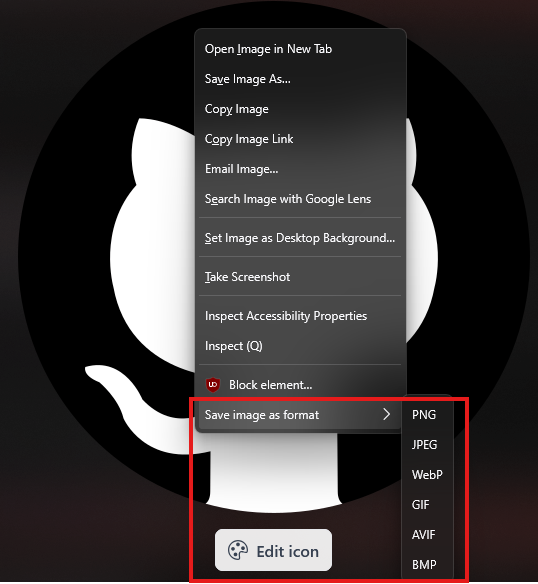

https://addons.mozilla.org/en-US/firefox/addon/save-image-as-format/

# Save Image as Format

A Firefox WebExtension that adds an image context-menu item named **Save image as format**.

To use it, simply right click on an image, and find the "Save image as format" button, hover over it, and then pick what format you would like.

The conversion happens on your device in the extension background page, so no data is sent anywhere. The extension fetches the selected image, decodes it in Firefox, draws it to a canvas, converts it to the chosen output format, and starts a normal Firefox download prompt.

I (codex) made this extension because I was tired of downloading corrupted images, or having to use web converting sites and downloading the image multiple times, blah blah blah... so I came up with this to solve my problems!

## Formats

- PNG
- JPEG
- WebP
- GIF
- AVIF
- BMP

JPEG, GIF, and BMP do not support full alpha transparency, so transparent pixels are flattened onto white (#FFFFFF).

Animated images are saved as the first decoded frame because browser canvas export is still-image based. GIF export creates a single-frame GIF. AVIF export uses Firefox's built-in canvas encoder and will show an error if the current Firefox build does not support `image/avif` export.

You can find the addon here: https://addons.mozilla.org/en-US/firefox/addon/save-image-as-format/

Feel free to give this repo a star if it made your life better! I want this to spread to as many people as I can to help!

If you have any issues, let me know in the issues tab, or any suggestions.
